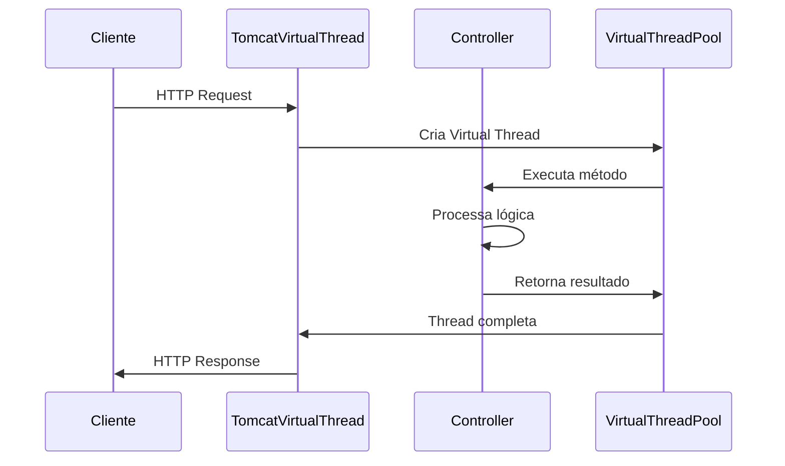

# FD - Functional Design Document
## Aplicação Spring Boot com Virtual Threads

### Informações do Documento
- **Versão**: 1.0
- **Data**: Agosto 2025
- **Projeto**: Spring Boot Virtual Threads Application
- **Relacionado a**: BRD-Business-Requirements.md
- **Autor**: Equipe de Desenvolvimento

---

## 1. Visão Geral Funcional

### 1.1 Propósito
Este documento descreve o design funcional da aplicação Spring Boot Virtual Threads, detalhando como os requisitos de negócio são traduzidos em funcionalidades específicas, APIs e comportamentos do sistema.

### 1.2 Arquitetura Funcional
A aplicação segue o padrão REST API com as seguintes camadas funcionais:
- **Camada de Apresentação**: Endpoints REST
- **Camada de Processamento**: Controladores Spring Boot
- **Camada de Configuração**: Configuração de Virtual Threads
- **Camada de Monitoramento**: Spring Actuator

---

## 2. Funcionalidades Principais

### 2.1 Gerenciamento de Threads (RF001, RF002)

#### Funcionalidade: Obter Informações da Thread Atual
- **ID**: FUNC-001
- **Descrição**: Permite obter informações detalhadas sobre a thread que está processando a requisição
- **Entrada**: Requisição HTTP GET
- **Saída**: String com representação da thread (nome, ID, pool)
- **Comportamento Esperado**: 
  - Retorna informações da thread virtual que processa a requisição
  - Formato: `VirtualThread[#ID]/estado@Pool-Worker-X`

#### Funcionalidade: Definir Nome da Thread
- **ID**: FUNC-002
- **Descrição**: Permite alterar o nome da thread atual para um valor personalizado
- **Entrada**: Requisição HTTP POST com nome desejado no path
- **Saída**: Mensagem de confirmação com o novo nome
- **Comportamento Esperado**:
  - Aceita qualquer string válida como nome
  - Altera apenas a thread que processa a requisição
  - Retorna confirmação do nome aplicado

### 2.2 Teste de Carga (RF003)

#### Funcionalidade: Simulação de Carga
- **ID**: FUNC-003
- **Descrição**: Simula operação I/O bound com delay controlado para testes de performance
- **Entrada**: Requisição HTTP GET
- **Saída**: Resposta vazia após delay
- **Comportamento Esperado**:
  - Executa sleep de 1 segundo (simulando I/O)
  - Registra log da operação
  - Permite teste de concorrência

### 2.3 Monitoramento de Saúde (RF004)

#### Funcionalidade: Health Check
- **ID**: FUNC-004
- **Descrição**: Fornece informações sobre o status da aplicação
- **Entrada**: Requisição HTTP GET para /actuator/health
- **Saída**: JSON com status da aplicação e componentes
- **Comportamento Esperado**:
  - Status UP quando aplicação está funcionando
  - Inclui informações sobre MongoDB (DOWN se não configurado)
  - Detalhes sempre visíveis conforme configuração

---

## 3. Especificação das APIs

### 3.1 API de Threads

#### GET /thread/name
```http
GET /thread/name HTTP/1.1
Host: localhost:8080
```

**Resposta de Sucesso:**
```http
HTTP/1.1 200 OK
Content-Type: text/plain

VirtualThread[#34]/runnable@ForkJoinPool-1-worker-1
```

**Casos de Uso:**
- UC-001: Desenvolvedores verificando se Virtual Threads estão ativas
- UC-002: Monitoring e debugging de threads
- UC-003: Demonstração do comportamento dos Virtual Threads

#### POST /thread/name/{name}
```http
POST /thread/name/MinhaThread HTTP/1.1
Host: localhost:8080
```

**Resposta de Sucesso:**
```http
HTTP/1.1 200 OK
Content-Type: text/plain

New name is: MinhaThread
```

**Validações:**
- Nome não pode ser null ou vazio
- Aceita caracteres alfanuméricos e símbolos
- Comprimento máximo: limitado pelo Java String

**Casos de Uso:**
- UC-004: Personalização de nomes para debugging
- UC-005: Identificação de threads em logs
- UC-006: Rastreamento de requisições específicas

### 3.2 API de Teste de Carga

#### GET /load
```http
GET /load HTTP/1.1
Host: localhost:8080
```

**Resposta de Sucesso:**
```http
HTTP/1.1 200 OK
Content-Length: 0
```

**Comportamento:**
- Executa Thread.sleep(1000) para simular I/O
- Registra log: "hey, I'm doing something"
- Virtual Thread não bloqueia thread do pool durante sleep

**Casos de Uso:**
- UC-007: Teste de performance sob carga
- UC-008: Demonstração de eficiência dos Virtual Threads
- UC-009: Benchmarking comparativo

### 3.3 API de Monitoramento

#### GET /actuator/health
```http
GET /actuator/health HTTP/1.1
Host: localhost:8080
```

**Resposta de Sucesso:**
```json
{
  "status": "UP",
  "components": {
    "diskSpace": {
      "status": "UP",
      "details": {
        "total": 123456789,
        "free": 987654321,
        "threshold": 10485760,
        "path": "/app/.",
        "exists": true
      }
    },
    "mongo": {
      "status": "DOWN",
      "details": {
        "error": "Connection refused"
      }
    },
    "ping": {
      "status": "UP"
    }
  }
}
```

**Casos de Uso:**
- UC-010: Verificação automática de saúde da aplicação
- UC-011: Integração com ferramentas de monitoramento
- UC-012: Alertas de status da aplicação

---

## 4. Fluxos de Processo

### 4.1 Fluxo de Requisição Padrão



### 4.2 Fluxo de Teste de Carga

```mermaid
graph TD
    A[Cliente envia GET /load] --> B[Virtual Thread criada]
    B --> C[Controller recebe requisição]
    C --> D[Log: 'hey, I'm doing something']
    D --> E[Thread.sleep(1000)]
    E --> F[Virtual Thread parkeada]
    F --> G[Carrier thread liberada]
    G --> H[Após 1s, Virtual Thread retoma]
    H --> I[Resposta enviada]
    I --> J[Virtual Thread finalizada]
```

### 4.3 Fluxo de Configuração de Virtual Threads

```mermaid
graph TD
    A[Spring Boot Inicia] --> B{spring.thread-executor=virtual?}
    B -->|Sim| C[ThreadsConfiguration ativa]
    B -->|Não| D[Configuração padrão]
    C --> E[Configura TaskExecutor]
    C --> F[Configura TomcatProtocolHandler]
    E --> G[Executors.newVirtualThreadPerTaskExecutor()]
    F --> G
    G --> H[Aplicação pronta com Virtual Threads]
    D --> I[Aplicação pronta com threads tradicionais]
```

---

## 5. Regras de Negócio

### 5.1 Regras de Configuração
- **RN-001**: Virtual Threads são habilitados apenas se property `spring.thread-executor=virtual`
- **RN-002**: Aplicação pode funcionar sem Virtual Threads como fallback
- **RN-003**: MongoDB é opcional, aplicação inicia mesmo sem conexão

### 5.2 Regras de Performance
- **RN-004**: Cada requisição HTTP utiliza uma Virtual Thread dedicada
- **RN-005**: Virtual Threads são criadas sob demanda
- **RN-006**: Não há limite artificial no número de Virtual Threads simultâneas

### 5.3 Regras de Comportamento
- **RN-007**: Nomes de threads são únicos por thread, não globalmente
- **RN-008**: Sleep em Virtual Threads não bloqueia carrier threads
- **RN-009**: Logs incluem identificação da Virtual Thread

---

## 6. Estados do Sistema

### 6.1 Estados da Aplicação
- **STARTING**: Aplicação inicializando
- **READY**: Aplicação pronta para receber requisições
- **PROCESSING**: Processando requisições
- **SHUTDOWN**: Aplicação sendo finalizada

### 6.2 Estados das Virtual Threads
- **CREATED**: Thread criada mas não iniciada
- **RUNNABLE**: Thread executando
- **PARKED**: Thread aguardando (durante I/O)
- **TERMINATED**: Thread finalizada

---

## 7. Tratamento de Erros

### 7.1 Erros de Sistema
- **ERR-001**: Falha na criação de Virtual Thread
  - **Resposta**: HTTP 500 - Internal Server Error
  - **Ação**: Log detalhado do erro, retry automático

- **ERR-002**: Configuração inválida
  - **Resposta**: Falha na inicialização
  - **Ação**: Log de erro, aplicação não inicia

### 7.2 Erros de Entrada
- **ERR-003**: Nome de thread inválido
  - **Resposta**: HTTP 400 - Bad Request
  - **Ação**: Mensagem de erro descritiva

- **ERR-004**: Endpoint não encontrado
  - **Resposta**: HTTP 404 - Not Found
  - **Ação**: Resposta padrão do Spring Boot

---

## 8. Configurações Funcionais

### 8.1 Configurações Obrigatórias
```properties
spring.application.name=threads
spring.thread-executor=virtual
```

### 8.2 Configurações de Monitoramento
```properties
management.endpoints.web.exposure.include=health
management.endpoint.health.show-details=always
```

### 8.3 Configurações Opcionais
```properties
# Configurações de MongoDB (opcional)
spring.data.mongodb.host=localhost
spring.data.mongodb.port=27017
spring.data.mongodb.database=threads

# Configurações de logging (opcional)
logging.level.com.example.threads=INFO
```

---

## 9. Casos de Uso Detalhados

### 9.1 UC-001: Verificar Virtual Threads Ativas

**Ator Principal**: Desenvolvedor/QA
**Pré-condições**: Aplicação executando com Virtual Threads habilitados
**Fluxo Principal**:
1. Desenvolvedor acessa GET /thread/name
2. Sistema retorna informações da Virtual Thread atual
3. Desenvolvedor verifica presença de "VirtualThread" na resposta

**Pós-condições**: Confirmação de que Virtual Threads estão funcionando

### 9.2 UC-008: Demonstração de Eficiência sob Carga

**Ator Principal**: Arquiteto/Lead técnico
**Pré-condições**: Aplicação executando, ferramenta de teste de carga disponível
**Fluxo Principal**:
1. Executar 1000 requisições simultâneas para /load
2. Sistema cria 1000 Virtual Threads
3. Todas as threads executam sleep(1000) simultaneamente
4. Sistema responde a todas as requisições em ~1 segundo
5. Verificar uso de recursos (CPU/memória)

**Pós-condições**: Demonstração de escalabilidade superior

---

## 10. Métricas e KPIs Funcionais

### 10.1 Métricas de Performance
- **Latência média**: < 1100ms para /load endpoint
- **Throughput**: > 1000 req/s para endpoints simples
- **Concorrência**: Suporte a 10000+ requisições simultâneas

### 10.2 Métricas de Qualidade
- **Disponibilidade**: > 99% uptime
- **Taxa de erro**: < 0.1%
- **Tempo de resposta P95**: < 1200ms

---

## 11. Integração com Sistemas

### 11.1 Integração com Spring Boot
- Utiliza autoconfiguration do Spring Boot
- Compatível com Spring MVC padrão
- Integração nativa com Spring Actuator

### 11.2 Integração com Java 21
- Aproveita Virtual Threads nativos
- Compatível com APIs padrão do Java
- Não requer bibliotecas externas para Virtual Threads

---

## 12. Considerações de Deployment

### 12.1 Requisitos de Runtime
- **Java**: Versão 21 ou superior (obrigatório)
- **Memória**: Mínimo 512MB heap
- **CPU**: 1 core mínimo, beneficia de múltiplos cores

### 12.2 Configurações de Produção
- Monitoramento de Virtual Threads através de JFR
- Configuração de logs estruturados
- Health checks automáticos

---

*Este documento serve como especificação funcional completa para implementação, testes e validação da aplicação Spring Boot com Virtual Threads.*