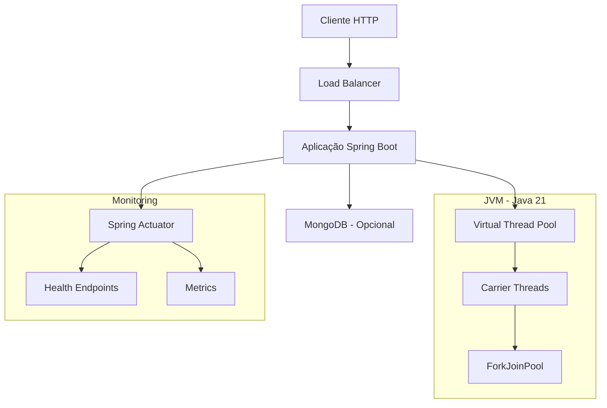
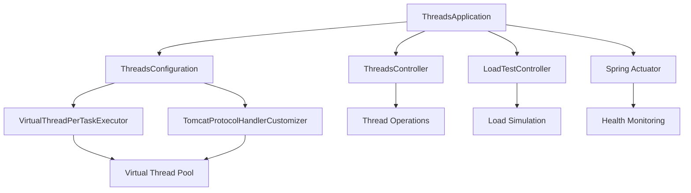

# TRD - Technical Requirements Document
## Aplicação Spring Boot com Virtual Threads

### Informações do Documento
- **Versão**: 1.0
- **Data**: Agosto 2025
- **Projeto**: Spring Boot Virtual Threads Application
- **Relacionado a**: BRD-Business-Requirements.md, FD-Functional-Design.md
- **Autor**: Equipe de Desenvolvimento

---

## 1. Visão Geral Técnica

### 1.1 Propósito
Este documento especifica os requisitos técnicos, arquitetura de sistema, tecnologias utilizadas e implementação técnica da aplicação Spring Boot Virtual Threads, fornecendo o blueprint técnico necessário para desenvolvimento, deploy e manutenção.

### 1.2 Arquitetura de Alto Nível



---

## 2. Requisitos de Infraestrutura

### 2.1 Requisitos de Hardware

#### Desenvolvimento
- **CPU**: 2+ cores (recomendado 4+ cores)
- **RAM**: 4GB mínimo (recomendado 8GB)
- **Armazenamento**: 10GB espaço livre
- **Rede**: Conexão à internet para downloads de dependências

#### Produção
- **CPU**: 4+ cores (recomendado 8+ cores)
- **RAM**: 8GB mínimo (recomendado 16GB+)
- **Armazenamento**: 50GB+ com SSD
- **Rede**: Largura de banda adequada para carga esperada

### 2.2 Requisitos de Software

#### Sistema Operacional
- **Linux**: Ubuntu 20.04+ (recomendado), CentOS 8+, RHEL 8+
- **Windows**: Windows 10+ (desenvolvimento)
- **macOS**: macOS 11+ (desenvolvimento)

#### Runtime Environment
- **Java**: OpenJDK 21 ou Oracle JDK 21 (OBRIGATÓRIO)
- **JVM Options**: 
  ```bash
  -XX:+UseZGC  # GC otimizado para Virtual Threads
  -XX:+UnlockExperimentalVMOptions
  -XX:+EnableDynamicAgentLoading  # Para ferramentas de debugging
  ```

---

## 3. Stack Tecnológico

### 3.1 Core Technologies

#### Framework Principal
- **Spring Boot**: 3.4.1
  - spring-boot-starter-web
  - spring-boot-starter-actuator
  - spring-boot-starter-data-mongodb (opcional)

#### Build e Dependências
- **Maven**: 3.8+ (wrapper incluído)
- **Lombok**: Para redução de boilerplate code
- **Maven Compiler Plugin**: Configurado para Java 21

### 3.2 Bibliotecas de Teste
- **JUnit 5**: Framework de testes
- **Spring Boot Test**: Testes integrados
- **Mockito**: Para mocking em testes
- **AssertJ**: Assertions fluentes

### 3.3 Monitoramento e Observabilidade
- **Spring Actuator**: Health checks e métricas
- **SLF4J + Logback**: Sistema de logging
- **Micrometer**: Métricas (preparado para Prometheus)

---

## 4. Arquitetura de Software

### 4.1 Padrões Arquiteturais
- **Layered Architecture**: Separação em camadas lógicas
- **REST API**: Comunicação via HTTP/JSON
- **Dependency Injection**: Gerenciamento de dependências via Spring
- **Configuration over Convention**: Configuração explícita de Virtual Threads

### 4.2 Estrutura de Pacotes
```
com.example.threads/
├── ThreadsApplication.java          # Main class
├── ThreadsConfiguration.java        # Virtual Threads config
├── ThreadsController.java          # Thread management API
└── LoadTestController.java         # Load testing API
```

### 4.3 Diagrama de Componentes



---

## 5. Especificação Técnica de Componentes

### 5.1 ThreadsConfiguration

#### Responsabilidades
- Configuração de Virtual Thread executor
- Customização do Tomcat para Virtual Threads
- Habilitação condicional baseada em properties

#### Implementação Técnica
```java
@EnableAsync
@Configuration
@ConditionalOnProperty(value = "spring.thread-executor", havingValue = "virtual")
public class ThreadsConfiguration {
    
    @Bean(TaskExecutionAutoConfiguration.APPLICATION_TASK_EXECUTOR_BEAN_NAME)
    public AsyncTaskExecutor executor() {
        return new TaskExecutorAdapter(Executors.newVirtualThreadPerTaskExecutor());
    }

    @Bean
    public TomcatProtocolHandlerCustomizer<?> protocolHandlerVirtualThreadExecutorCustomizer() {
        return protocolHandler -> {
            protocolHandler.setExecutor(Executors.newVirtualThreadPerTaskExecutor());
        };
    }
}
```

#### Dependências Técnicas
- `java.util.concurrent.Executors`
- `org.springframework.core.task.AsyncTaskExecutor`
- `org.springframework.boot.web.embedded.tomcat.TomcatProtocolHandlerCustomizer`

### 5.2 ThreadsController

#### Responsabilidades
- Exposição de APIs para gerenciamento de threads
- Demonstração de funcionalidades de Virtual Threads
- Logging e debugging de informações de thread

#### Endpoints Técnicos
```java
@RestController
@RequestMapping("/thread")
public class ThreadsController {
    
    @GetMapping("/name")
    public String getThreadName() {
        return Thread.currentThread().toString();
    }

    @PostMapping("/name/{name}")
    public String saveByName(@PathVariable String name) {
        Thread.currentThread().setName(name);
        return "New name is: " + name;
    }
}
```

### 5.3 LoadTestController

#### Responsabilidades
- Simulação de operações I/O bound
- Teste de performance de Virtual Threads
- Demonstração de não-bloqueio de carrier threads

#### Implementação de Performance
```java
@RestController
@RequestMapping("/load")
public class LoadTestController {
    
    @GetMapping
    public void doSomething() throws InterruptedException {
        LOG.info("hey, I'm doing something");
        Thread.sleep(1000);  // Virtual Thread park, não bloqueia carrier
    }
}
```

---

## 6. Configuração de Virtual Threads

### 6.1 Configuração do Spring Boot

#### application.properties
```properties
# Core configuration
spring.application.name=threads
spring.thread-executor=virtual

# Actuator configuration
management.endpoints.web.exposure.include=health
management.endpoint.health.show-details=always

# Optional MongoDB configuration
spring.data.mongodb.host=localhost
spring.data.mongodb.port=27017
spring.data.mongodb.database=threads
```

### 6.2 JVM Configuration

#### Parâmetros Recomendados
```bash
# Para desenvolvimento
-Xmx2g
-Xms512m
-XX:+UseZGC
-XX:+UnlockExperimentalVMOptions

# Para produção
-Xmx8g
-Xms2g
-XX:+UseZGC
-XX:+UnlockExperimentalVMOptions
-XX:+FlightRecorder
-XX:StartFlightRecording=duration=60s,filename=vthreads.jfr
```

### 6.3 Monitoramento de Virtual Threads

#### JFR Events
- `jdk.VirtualThreadStart`
- `jdk.VirtualThreadEnd`
- `jdk.VirtualThreadPinned`
- `jdk.VirtualThreadSubmitFailed`

---

## 7. Performance e Escalabilidade

### 7.1 Benchmarks Esperados

#### Thread Creation
- **Virtual Threads**: ~1 milhão threads/segundo
- **Platform Threads**: ~1000 threads/segundo
- **Memory per Thread**: ~100 bytes (virtual) vs ~2MB (platform)

#### I/O Performance
- **Concurrent Operations**: 10,000+ simultâneas
- **Memory Usage**: Linear com carga, não exponencial
- **CPU Utilization**: Otimizada para operações I/O bound

### 7.2 Limites Técnicos

#### Virtual Threads
- **Máximo Teórico**: Limitado pela memória heap disponível
- **Recomendado**: < 1 milhão threads simultâneas
- **Monitoramento**: Via JFR e métricas customizadas

#### Carrier Threads
- **Padrão**: Número de CPU cores disponíveis
- **Configurável**: Via system property `jdk.virtualThreadScheduler.parallelism`

---

## 8. Segurança Técnica

### 8.1 Considerações de Segurança
- **Thread Isolation**: Virtual Threads herdam security context
- **Resource Limits**: Sem proteção built-in contra thread bombing
- **Memory Protection**: Garbage collection normal se aplica

### 8.2 Mitigações Recomendadas
```java
// Rate limiting por IP
@Component
public class RateLimitFilter implements Filter {
    // Implementação de rate limiting
}

// Circuit breaker para proteção
@Component
public class CircuitBreakerComponent {
    // Implementação de circuit breaker
}
```

---

## 9. Monitoramento e Debugging

### 9.1 Métricas Técnicas

#### JVM Metrics
- `jvm.threads.virtual.count`: Número de Virtual Threads ativas
- `jvm.threads.carrier.count`: Número de Carrier Threads
- `jvm.memory.heap.usage`: Uso de heap

#### Application Metrics
- `http.requests.duration`: Duração de requisições
- `http.requests.concurrent`: Requisições simultâneas
- `threads.virtual.created`: Total de Virtual Threads criadas

### 9.2 Logging Configuration

#### logback-spring.xml
```xml
<configuration>
    <appender name="STDOUT" class="ch.qos.logback.core.ConsoleAppender">
        <encoder>
            <pattern>%d{yyyy-MM-dd HH:mm:ss} [%thread] %-5level %logger{36} - %msg%n</pattern>
        </encoder>
    </appender>
    
    <logger name="com.example.threads" level="INFO"/>
    <root level="INFO">
        <appender-ref ref="STDOUT"/>
    </root>
</configuration>
```

### 9.3 Debugging Tools

#### Development
- **JFR (Java Flight Recorder)**: Para profiling detalhado
- **JConsole**: Monitoramento básico da JVM
- **VisualVM**: Profiling e análise de performance

#### Production
- **APM Tools**: New Relic, AppDynamics, Dynatrace
- **Prometheus + Grafana**: Métricas e alertas
- **ELK Stack**: Centralização de logs

---

## 10. Build e Deploy

### 10.1 Build Configuration

#### pom.xml (Principais seções)
```xml
<properties>
    <java.version>21</java.version>
    <spring-boot.version>3.4.1</spring-boot.version>
</properties>

<dependencies>
    <dependency>
        <groupId>org.springframework.boot</groupId>
        <artifactId>spring-boot-starter-web</artifactId>
    </dependency>
    <!-- Outras dependências -->
</dependencies>

<build>
    <plugins>
        <plugin>
            <groupId>org.apache.maven.plugins</groupId>
            <artifactId>maven-compiler-plugin</artifactId>
            <configuration>
                <source>21</source>
                <target>21</target>
                <compilerArgs>
                    <arg>--enable-preview</arg> <!-- Se usando features preview -->
                </compilerArgs>
            </configuration>
        </plugin>
    </plugins>
</build>
```

### 10.2 Comandos de Build

#### Desenvolvimento
```bash
# Setup do ambiente
export JAVA_HOME=/usr/lib/jvm/java-21-openjdk-amd64
export PATH=$JAVA_HOME/bin:$PATH

# Build commands
./mvnw clean compile          # Compilação
./mvnw test                   # Testes
./mvnw clean package          # Build completo
./mvnw spring-boot:run        # Execução local
```

#### Produção
```bash
# Build para produção
./mvnw clean package -DskipTests

# Execução
java -jar target/threads-0.0.1-SNAPSHOT.jar

# Com parâmetros otimizados
java -Xmx4g -XX:+UseZGC \
     -jar target/threads-0.0.1-SNAPSHOT.jar \
     --server.port=8080
```

### 10.3 Containerização

#### Dockerfile
```dockerfile
FROM openjdk:21-jdk-slim

WORKDIR /app

COPY target/threads-0.0.1-SNAPSHOT.jar app.jar

EXPOSE 8080

ENV JAVA_OPTS="-Xmx2g -XX:+UseZGC"

ENTRYPOINT ["sh", "-c", "java $JAVA_OPTS -jar app.jar"]
```

#### docker-compose.yml
```yaml
version: '3.8'
services:
  threads-app:
    build: .
    ports:
      - "8080:8080"
    environment:
      - SPRING_PROFILES_ACTIVE=production
      - JAVA_OPTS=-Xmx4g -XX:+UseZGC
    healthcheck:
      test: ["CMD", "curl", "-f", "http://localhost:8080/actuator/health"]
      interval: 30s
      timeout: 10s
      retries: 3
```

---

## 11. Troubleshooting Técnico

### 11.1 Problemas Comuns

#### Virtual Threads não funcionando
**Sintomas**: Thread names mostram "Thread" ao invés de "VirtualThread"
**Causa**: Java < 21 ou configuração incorreta
**Solução**: 
```bash
# Verificar versão Java
java -version

# Verificar propriedade
spring.thread-executor=virtual
```

#### Performance inferior ao esperado
**Sintomas**: Alto uso de CPU ou baixo throughput
**Causa**: Thread pinning ou blocking calls
**Solução**: 
- Usar Virtual Thread-friendly APIs
- Evitar synchronized blocks extensos
- Monitorar via JFR

#### Memory leaks
**Sintomas**: Crescimento contínuo de heap
**Causa**: Threads não finalizadas ou references retidas
**Solução**: 
```java
// Monitoring de threads ativas
long activeVirtualThreads = Thread.getAllStackTraces()
    .keySet()
    .stream()
    .filter(Thread::isVirtual)
    .count();
```

### 11.2 Ferramentas de Diagnóstico

#### JFR Recording
```bash
# Start recording
java -XX:+FlightRecorder \
     -XX:StartFlightRecording=duration=60s,filename=vthreads.jfr \
     -jar app.jar

# Analyze recording
jfr print --events jdk.VirtualThreadStart,jdk.VirtualThreadEnd vthreads.jfr
```

#### Thread Dumps
```bash
# Generate thread dump
jstack <pid> > threaddump.txt

# Analyze virtual threads
jcmd <pid> Thread.dump_to_file -format=text threaddump.txt
```

---

## 12. Roadmap Técnico

### 12.1 Versão Atual (1.0)
- ✅ Implementação básica de Virtual Threads
- ✅ APIs de demonstração
- ✅ Configuração básica
- ✅ Testes unitários

### 12.2 Próximas Versões

#### v1.1 - Melhorias de Observabilidade
- Métricas customizadas para Virtual Threads
- Dashboard Grafana específico
- Alertas automatizados

#### v1.2 - Performance Optimization
- Tuning de configurações
- Benchmarks automatizados
- Comparações com threading tradicional

#### v1.3 - Production Hardening
- Rate limiting
- Circuit breakers
- Graceful shutdown

---

## 13. Referências Técnicas

### 13.1 Documentação Oficial
- [JEP 444: Virtual Threads](https://openjdk.org/jeps/444)
- [Spring Boot 3.x Virtual Threads](https://spring.io/blog/2022/10/11/embracing-virtual-threads)
- [Java 21 Documentation](https://docs.oracle.com/en/java/javase/21/)

### 13.2 Best Practices
- [Virtual Threads Best Practices](https://inside.java/2021/05/10/networking-io-with-virtual-threads/)
- [Spring Boot Virtual Threads Guide](https://docs.spring.io/spring-boot/docs/current/reference/html/features.html#features.task-execution-and-scheduling)

### 13.3 Benchmarks e Studies
- [Project Loom Performance Studies](https://wiki.openjdk.org/display/loom/Performance)
- [Virtual Threads vs Traditional Threading](https://blogs.oracle.com/javamagazine/post/going-inside-javas-project-loom-and-virtual-threads)

---

*Este documento serve como referência técnica completa para implementação, manutenção e evolução da aplicação Spring Boot com Virtual Threads.*